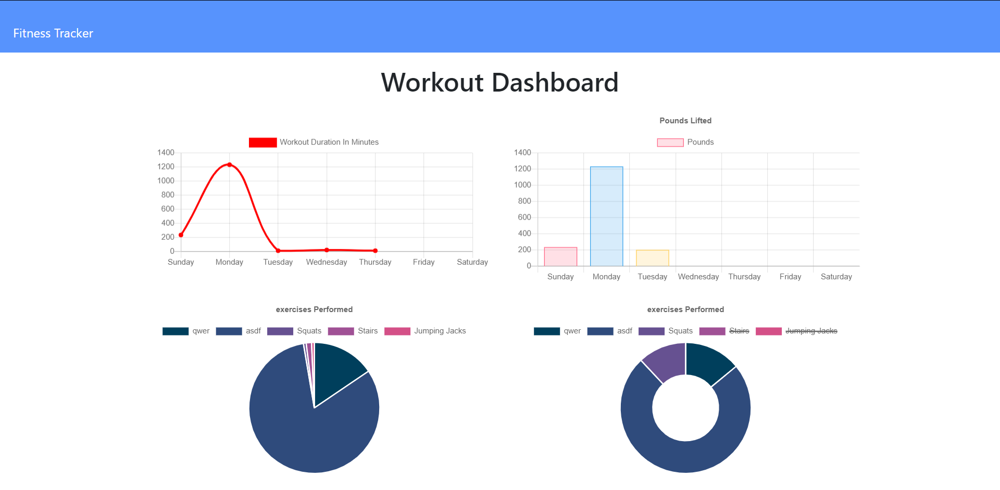

# My Workout Tracker

## Deployed Link
https://fitness-tracker-coolness.herokuapp.com/

## Discription
This application is a workout tracker using Mongo, Heroku, JawsDB, Node, Express, and Mongoose.

## Use
Open the link above and add workouts to test it out

## Deployment

### Requirements 
  - Github
  - Mongo/Robo 3T
  - Heroku
  - mLab MongoDB: Heroku add-on

### Directions
  - Clone this repository:
    - Open Command Line Interface (CLI) and navigate to the folder you want to clone this repository into.
    - CLI Command: "git clone git@github.com:ajrsabet/my_workout_tracker.git"
    - CLI Command: "npm install"
  
  Localhost setup:
  - CLI Command: "node server.js"
  - In browser go to: http://localhost:3000
  
  Heroku deployment:
  - Create a new Heroku app by following the directions at: https://devcenter.heroku.com/articles/creating-apps
  - Open your new Heroku app by loging into your account or, if you setup the project through your CLI, by following the link provided (example: https://git.heroku.com/example.git)
  - Click on "Configure Add-ons" and search for "mLab MongoDB"
  - Setup mLab by following the documentation at: https://devcenter.heroku.com/articles/mongolab
  - Push your changes to Github
  - CLI comand: "git push heroku master"
  - Open your Heroku deployed link

